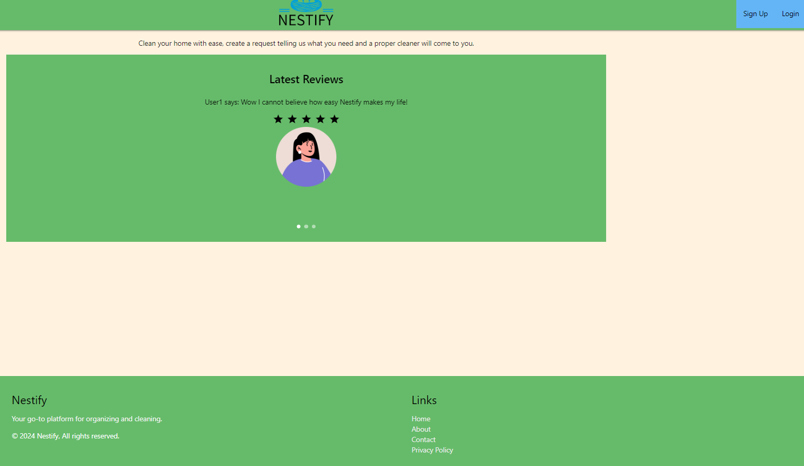
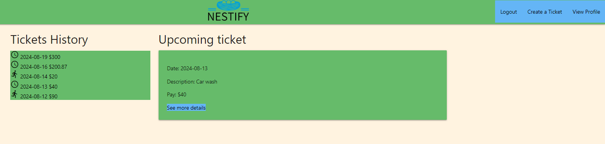
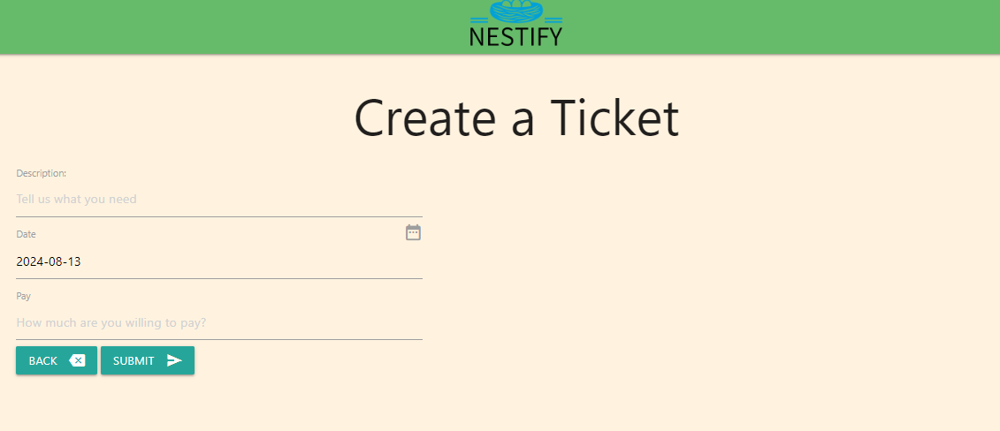
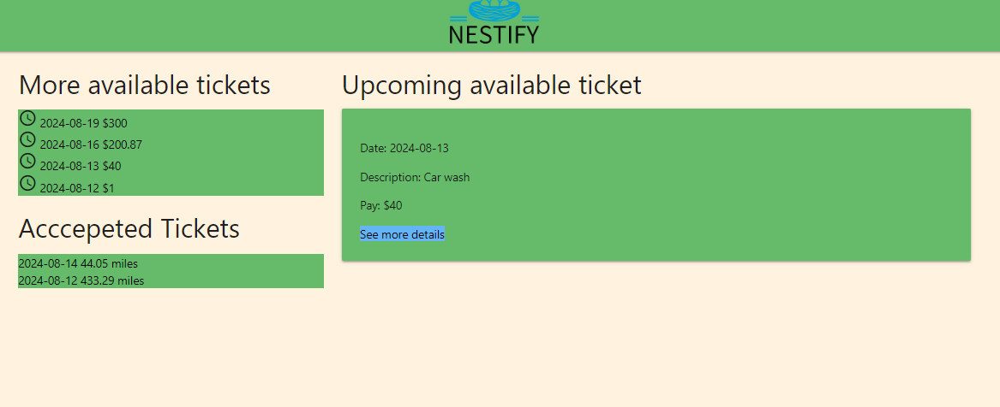
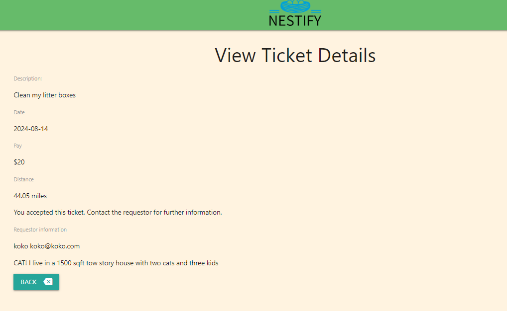

# Nestify

***
## Table of contents
- Nestify
  - [Description](#Description)
  - [Installation](#Installation)
  - [Usage](#Usage)
  - [Contributing](#Contributing)
  - [License](#License)
  - [Questions](#Questions)
  - [Screenshot](#Screenshot)

***
## Description
"Effortlessly browse, post, and manage job listings on Nestify with our user-friendly website. Streamlined features make it easy for those in need of help to connect with potential workers. Stay organized and save time with customizable alerts and seamless communication tools." [A demo server is updated and running here](https://nestify-6l3a.onrender.com/)

***
## Installation
- The generator requires Node.js.  [See Node.js installation.](https://docs.npmjs.com/downloading-and-installing-node-js-and-npm)
1. Clone this repo using `git clone`: `https://github.com/justkuper/Nestify`
2. In the terminal, move to where the cloned local repo is. `cd new_repo`
3. `npm install`
4. Set up the database schema and seeds data: In the terminal move into the folder db/
   type `psql -U postgres` you will need to enter the password for Postgres user postgres. Next in the Postgres bash:
   type `\i schema.sql` 
     - exit by typing  `\q`
5. Create a `.env` file in the root folder to host environmental variables
   - DB_NAME='nestify_db'
   - DB_USER='postgres'
   - DB_PASSWORD= your lovely password here
   - DB_SESSION_KEY = something fun!
6. Run the seed data, by running the seed command `npm run seed`
7. Start your server using the command `npm run start`
8. Ready to use after the modules are installed, head over to the url `http://localhost:3001` to see the application 

***
## Usage
1. Once the server is running, go to `http://localhost:3001` from a browser and sign up to be a user to create tickets or as a provider to accept tickets. 

2. To sign up fill out a form:
	Username:
	Email:
	Password:
	Zip Code:
	About yourself:
	Check one: [ ] User or [ ] Provider

3. As a user, create a job ticket:
	Job Description:
	Date you want it done:
	Pay:

4. As a provider, view upcoming and accepted tickets.

5. Follow up with the email provided to coordinate the logistics of your next job!

***
## Contributing
See [Questions](#Questions) for contact info.

***
## License
This project adopts WTFPL license practices. Check the website for license details: [License: WTFPL](http://www.wtfpl.net/about/)

***
## Questions
[Arturo Ayala GitHub profile.](https://github.com/kalisurf3r)
[Kuper Bank GitHub profile.](https://github.com/justkuper)
[Po Shin Huang GitHub profile.](https://github.com/momokokong)

***
## Screenshot
- Homepage

- User dashboard.

- User creates a ticket

- Provider dashboard

- Provider views a ticket and accepts if applicable

